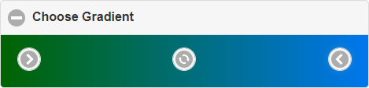

# Gradient Chooser Widget

[](https://coveralls.io/github/Vertumnus/jqm-gradient-chooser?branch=master)
[](https://www.npmjs.com/package/jqm-gradient-chooser)
[](https://www.npmjs.com/package/jqm-gradient-chooser)
[](https://www.npmjs.com/package/jqm-gradient-chooser)

This is a widget for jQuery mobile. It is an extension of a [collapsible widget](http://api.jquerymobile.com/collapsible/).
The widget has only one element in the collapsible list. This element contains a from color, to color and an action button. 
Specify the label of the gradient chooser widget like of the collapsible widget with e.g. an H1 tag.

## Preview


## Preconditions
The widget is implemented in ECMAScript 2015, so your project should support
at least this version.
To use the widget of course you need also [jQuery](http://jquery.com) and [jQuery Mobile](http://jquerymobile.com).

## Installation
Installation via npm:
```shell
npm install jqm-gradient-chooser
```

Download built files:
* [jqm-gradient-chooser.min.css](./bin/jqm-gradient-chooser.min.css)
* [jqm-gradient-chooser.min.js](./bin/jqm-gradient-chooser.min.js)

## Integration
Link the CSS file nearby to your other CSS files in the header section of your HTML file:
```html
<link rel="stylesheet" href="stylesheets/jqm-gradient-chooser.min.css">
```

Include the JS file right after jQuery JS file and jQuery mobile JS file:
```html
<script src="javascripts/jquery.min.js"></script>
<script src="javascripts/jquery.mobile.min.js"></script>
<script src="javascripts/jqm-gradient-chooser.min.js"></script>
```

## Usage
### Definition in your HTML file
Create the gradient chooser by adding the `data-role="gradientchooser"` attribute to a div:
```html
<div id="gradient" data-role="gradientchooser"></div>
```

You can use also all the attributes of the [collapsible widget](http://api.jquerymobile.com/collapsible/).

### Options
Beside the options of the collapsible widget, you have following options.

#### actionIcon
__Type:__ String

__Default:__ `'action'`

You can specify a different action button icon.
```js
// set action button icon to recycle
$('#gradient').gradientchooser('option', 'actionIcon', 'recycle')
```

#### fromIcon
__Type:__ String

__Default:__ `'carat-r'`

You can specify a different from color icon.
```js
// set from color icon to arrow right
$('#gradient').gradientchooser('option', 'fromIcon', 'arrow-r')
```

#### toIcon
__Type:__ String

__Default:__ `'carat-l'`

You can specify a different to color icon.
```js
// set to color icon to arrow left
$('#gradient').gradientchooser('option', 'toIcon', 'arrow-l')
```

#### colorFrom
__Type:__ String

__Default:__ `'#000000'`

With this option you can specify the from color of the gradient.
```js
// set from color to violet
$('#gradient').gradientchooser('option', 'colorFrom', '#ff00ff')
```

#### colorTo
__Type:__ String

__Default:__ `'#000000'`

With this option you can specify the to color of the gradient.
```js
// set to color to green
$('#gradient').gradientchooser('option', 'colorTo', 'rgb(0, 255, 0)')
```

### Methods
You can use following methods.

#### colorFrom
You can get or set the from color.
```js
// get from color
var colorFrom = $('#gradient').gradientchooser('colorFrom')

// set from color (to blue)
$('#gradient').gradientchooser('colorFrom', 'rgb(0, 0, 255)')
```

#### colorTo
You can get or set the to color.
```js
// get to color
var colorTo = $('#gradient').gradientchooser('colorTo')

// set to color (to red)
$('#gradient').gradientchooser('colorTo', '#ff0000')
```

### Events
You can register on following events. You will need them to supply colors and to apply the gradient for whatever you need it.

#### clickFrom
The widget triggers this event, if the user clicks on the from color button.

```js
// register on the event
$('#gradient').gradientchooser('option', 'clickFrom', function(){
   // do something, e.g. let the user pick a color and set the from color
}
```

#### clickTo
The widget triggers this event, if the user clicks on the to color button.

```js
// register on the event
$('#gradient').gradientchooser('option', 'clickTo', function(){
   // do something, e.g. let the user pick a color and set the to color
}
```

#### apply
The widget triggers this event, if the user clicks on the action button.

```js
// register on the event
$('#gradient').gradientchooser('option', 'apply', function(){
   // do something, e.g. get the from and to color 
   // to use them with a gradient effect
}
```

## Behavior
Everytime you change one of the colors the widget shows the corresponding gradient on the expanded area.

As color you can specify two different formats:
* `#rrggbb` - whereby rr is the hexadecimal value for red, gg for green, bb for blue
* `rgb(r, g, b)` - whereby r is the decimal value for red, g for green, b for blue

The widget returns the color in the same format as given.

## Example
See the [manual test HTML page](./test/gradientchooser.man.html) to get an idea how it works.

## License
MIT